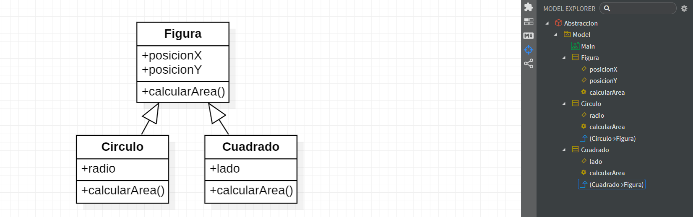
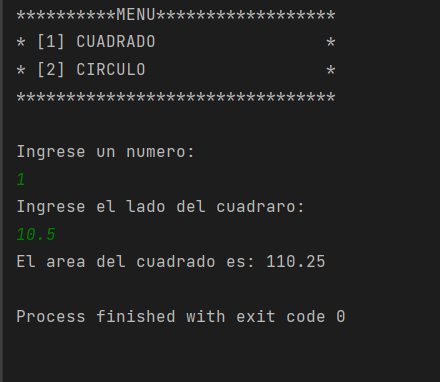
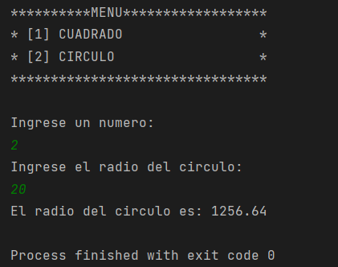

# POO - Abstraccion

Practica Programacion Orientado a Objetos usando la abstraccion
en JAVA, sistema de calculo del area de una figura.

## Diagrama

## Resultados por consola
## Figura 1 Cuadrado

## Figura 2 Circulo

